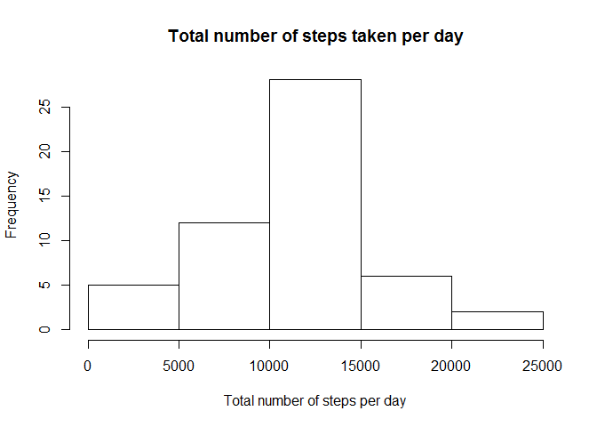
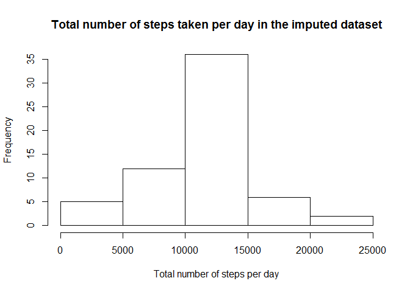
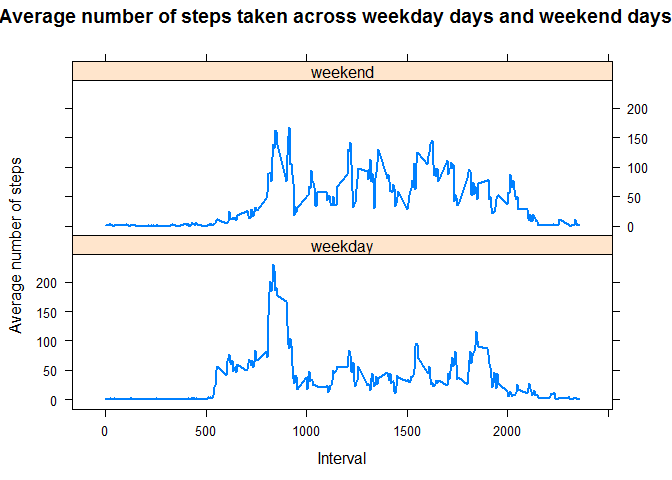

# load needed packages

```r
library(dplyr)
```

```
## Warning: package 'dplyr' was built under R version 3.6.2
```

```
## 
## Attaching package: 'dplyr'
```

```
## The following objects are masked from 'package:stats':
## 
##     filter, lag
```

```
## The following objects are masked from 'package:base':
## 
##     intersect, setdiff, setequal, union
```

```r
library(lattice)
```

# Setting figures 

```r
knitr::opts_chunk$set(fig.path='Figs/')
```

# Read and processing data

```r
setwd("C:/Users/Federica/Desktop/Prove_coursera")
raw_activity <- read.csv("activity.csv", sep = ",")
activity <- raw_activity[which(!is.na(raw_activity$steps)), ]
activity$date <- as.Date(activity$date)
head(activity)
```

```
##     steps       date interval
## 289     0 2012-10-02        0
## 290     0 2012-10-02        5
## 291     0 2012-10-02       10
## 292     0 2012-10-02       15
## 293     0 2012-10-02       20
## 294     0 2012-10-02       25
```

# What is mean total number of steps taken per day?
Calculate the total number of steps taken per day.

```r
by_day <- activity %>% group_by(date) 
Steps_day <- by_day %>% summarise(totalSteps = sum(steps))
head(Steps_day)
```

```
## # A tibble: 6 x 2
##   date       totalSteps
##   <date>          <int>
## 1 2012-10-02        126
## 2 2012-10-03      11352
## 3 2012-10-04      12116
## 4 2012-10-05      13294
## 5 2012-10-06      15420
## 6 2012-10-07      11015
```

Make a histogram of the total number of steps taken each day Calculate 

```r
hist(Steps_day$totalSteps, xlab = "Total number of steps per day", main = "Total number of steps taken per day")
```

<!-- -->

Report the mean and median of the total number of steps taken per day

```r
mean(Steps_day$totalSteps)
```

```
## [1] 10766.19
```

```r
median(Steps_day$totalSteps)
```

```
## [1] 10765
```
**The mean of total number of steps taken per day is 10766.19**
**The median of total number of steps taken per day is 10765**

# What is the average daily activity pattern?
Make a time series plot (i.e. type = "l") of the 5-minute interval (x-axis) and the average number of steps taken, averaged across all days (y-axis)

```r
by_interval <- activity %>% group_by(interval) 
average_interval <- by_interval %>% summarise(averageSteps = mean(steps))
plot(x = average_interval$interval, y = average_interval$averageSteps, type = "l", xlab = "Interval", ylab = "Average number of steps", main = "Average number of steps taken across all days")
```

<!-- -->

Which 5-minute interval, on average across all the days in the dataset, contains the maximum number of steps?

```r
average_interval[which.max(average_interval$averageSteps), ]
```

```
## # A tibble: 1 x 2
##   interval averageSteps
##      <int>        <dbl>
## 1      835         206.
```
**The 5-min interval with the highest average steps (avg number of steps = 206) is 835**

# Imputing missing values
Calculate and report the total number of missing values in the dataset (i.e. the total number of rows with NAs)

```r
#rereading the data (I have removed missing value a the beining of the analysis)
sum(is.na(raw_activity))
```

```
## [1] 2304
```
**The total number of missing value is 2304**

Devise a strategy for filling in all of the missing values in the dataset (I am using the mean for that 5-minute interval) and create a new dataset that is equal to the original dataset but with the missing data filled in.

```r
for (i in 1:nrow(raw_activity)) {
        if(is.na(raw_activity$steps[i] == TRUE)) {
        avg <- average_interval$averageSteps[which(average_interval$interval == raw_activity$interval[i])] 
             raw_activity$steps[i] <- avg  
             }
        } 
imputed_data <- raw_activity
head(imputed_data)
```

```
##       steps       date interval
## 1 1.7169811 2012-10-01        0
## 2 0.3396226 2012-10-01        5
## 3 0.1320755 2012-10-01       10
## 4 0.1509434 2012-10-01       15
## 5 0.0754717 2012-10-01       20
## 6 2.0943396 2012-10-01       25
```

Make a histogram of the total number of steps taken each day 

```r
by_day_imp <- imputed_data %>% group_by(date) 
Steps_day_imp <- by_day_imp %>% summarise(totalSteps = sum(steps))
head(Steps_day_imp)
```

```
## # A tibble: 6 x 2
##   date       totalSteps
##   <fct>           <dbl>
## 1 2012-10-01     10766.
## 2 2012-10-02       126 
## 3 2012-10-03     11352 
## 4 2012-10-04     12116 
## 5 2012-10-05     13294 
## 6 2012-10-06     15420
```

```r
hist(Steps_day_imp$totalSteps, xlab = "Total number of steps per day", main = "Total number of steps taken per day in the imputed dataset")
```

<!-- -->

Calculate and report the mean and median total number of steps taken per day

```r
mean(Steps_day_imp$totalSteps)
```

```
## [1] 10766.19
```

```r
median(Steps_day_imp$totalSteps)
```

```
## [1] 10766.19
```
**The mean of total number of steps taken per day using the imputed dataset is 10766.19. There is not difference in mean value.**
**The median of total number pf steps taken per day using the imputed datase is 10766.19. There is slight difference in median value**

# Are there differences in activity patterns between weekdays and weekends?
Create a new factor variable in the dataset with two levels – “weekday” and weekend” indicating whether a given date is a weekday or weekend day.

```r
imputed_data$date <- as.Date(imputed_data$date)
imputed_data$weekday <- weekdays(imputed_data$date)
imputed_data$weekday[imputed_data$weekday %in% c("sabato", "domenica")] <- "weekend"
imputed_data$weekday[imputed_data$weekday %in% c("lunedì", "martedì", "mercoledì", "giovedì", "venerdì")] <- "weekday"
imputed_data$weekday <- as.factor(imputed_data$weekday)
```

Make a panel plot containing a time series plot (i.e.type = "l") of the 5-minute interval (x-axis) and the average number of steps taken, averaged across all weekday days or weekend days (y-axis). 

```r
by_interval_imp <- imputed_data %>% group_by(interval, weekday) 
average_interval_imp <- by_interval_imp %>% summarise(averageSteps = mean(steps))

myplot <- xyplot(averageSteps ~ interval| weekday, data = average_interval_imp, layout = c(1, 2), type = "l", lwd = 2, xlab = "Interval", ylab = "Average number of steps", main = "Average number of steps taken across weekday days and weekend days")
myplot
```

<!-- -->

